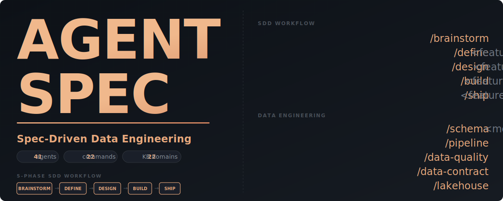

<div align="center">

<picture>
  <source media="(prefers-color-scheme: dark)" srcset="assets/banner.svg">
  <source media="(prefers-color-scheme: light)" srcset="assets/banner.svg">
  
</picture>

<br/><br/>

[](plugin/)
[](LICENSE)
[](CHANGELOG.md)

**Desenvolvimento guiado por especificação com IA — Workflows nativos do GitHub, controlados por labels, executados por agentes inteligentes.**

<br/>

[O que é?](#o-que-é-agentspec) · [Começar](#como-funciona) · [Feature](#novo-feature-sdd) · [Bugfix](#bugfix) · [Setup](#configuração)

</div>

---

## O que é AgentSpec?

**AgentSpec** é um framework de desenvolvimento guiado por especificação que usa agentes de IA para automatizar o processo de criação e correção de código. Em vez de escrever todo o código manualmente, você descreve o que quer e os agentes IA fazem o trabalho pesado.

### Por que usar?

- **Menos tempo escrevendo** — descreva o que quer, os agentes geram o código
- **Melhor documentação** — cada feature vem com especificação completa
- **Padrão consistente** — todas as features seguem o mesmo fluxo estruturado
- **Rastreabilidade** — história completa de decisões em cada issue
- **Integração nativa GitHub** — sem ferramentas extras, tudo na plataforma que você já usa

### O que você pode fazer?

Você pode usar AgentSpec para:

✨ **Desenvolver features novas** com 5 fases estruturadas (brainstorm → define → design → build → ship)

🐛 **Diagnosticar e corrigir bugs** com análise de root cause automática

📊 **Projetar pipelines de dados** — DAGs, schemas, tabelas, transformações

🔍 **Revisar código** — análise automatizada de qualidade, segurança e performance

📈 **Gerar documentação** — READMEs, diagramas de arquitetura, slides de apresentação

🧪 **Escrever testes** — geradores automáticos de testes unitários e integração

💾 **Projetar schemas** — star schema, Data Vault, SCD type 2, etc

---

## Como Funciona

O fluxo é simples: **você cria uma issue, adiciona um label, o agente faz o trabalho, posta o resultado como comentário**.

```
┌─────────────────────────────────────────────────────────────────┐
│                  VOCÊ CRIA UMA ISSUE                             │
│              "feat: novo endpoint de login"                      │
│              Target Repo: meu/repo-alvo                          │
└──────────────────────┬──────────────────────────────────────────┘
                       │
                       ↓ você adiciona label "sdd:brainstorm"
                       │
┌──────────────────────────────────────────────────────────────────┐
│ GitHub Action dispara → Claude API executa → resultado postado  │
│ O agente explora a ideia, lista abordagens, levanta perguntas   │
└──────────────────────┬──────────────────────────────────────────┘
                       │
                       ↓ você discute no comentário
                       ↓ valida a direção
                       ↓ adiciona próximo label "sdd:define"
                       │
┌──────────────────────────────────────────────────────────────────┐
│ GitHub Action dispara → Claude API executa → resultado postado  │
│ O agente gera requisitos estruturados (FR, NFR, constraints)    │
└──────────────────────┬──────────────────────────────────────────┘
                       │
        ┌──────────────┴──────────────┐
        │ continua até...              │
        ↓                              │
    (design → build → ship)            │
                                       ↓
                        FEATURE COMPLETA COM DOCUMENTAÇÃO
```

### Dois Fluxos Disponíveis

| Fluxo | Quando usar | Fases | Tempo típico |
|-------|-------------|-------|--------------|
| **SDD Feature** | Criar algo novo, feature, melhoria | **6 fases** (com review) | 45-90 min |
| **Bugfix** | Corrigir problema, patch, hotfix | 3 fases | 10-20 min |

---

## Novo Feature (SDD)

O fluxo SDD tem **6 fases estruturadas**. Após o design, 3 agentes discutem a melhor abordagem antes da implementação. Você só participa se quiser sugerir melhorias.

### Fluxo Completo

```
sdd:brainstorm → sdd:define → sdd:design → sdd:review → sdd:build → sdd:ship
   (Ideia)      (Requisitos)  (Arquitetura) (Consenso)  (Código)    (Entrega)
```

A fase **`sdd:review`** é automática:
- 3 agentes analisam o DESIGN (Arquitetura, Segurança, DevOps)
- Cada um dá suas recomendações
- Consolida tudo em um DESIGN melhorado
- **Você aprova ou ajusta** antes do build

### Passo a passo

#### **Fase 0: Brainstorm** 🧠
Você cria uma issue com a ideia geral:

```markdown
Title: feat: pipeline Odoo 17 com Docker
Target Repo: guilhermePiauhy/odoo-piauhy
Objetivo: Criar docker-compose para prod e dev com Nginx reverse proxy e PostgreSQL
Contexto: Projeto Odoo atual está em server físico, queremos containerizar
```

Adicione o label **`sdd:brainstorm`** → O agente:
- Explora diferentes abordagens
- Lista tecnologias possíveis
- Levanta perguntas sobre requisitos
- Sugere trade-offs

**Você faz:** Ler, discutir no comentário, esclarecer pontos, validar direção

---

#### **Fase 1: Define** 📋
Você adiciona o label **`sdd:define`** → O agente:
- Lê toda discussão da fase anterior
- Extrai requisitos estruturados:
  - **FR (Functional Requirements):** o que o sistema deve fazer
  - **NFR (Non-Functional Requirements):** performance, segurança, escalabilidade
  - **Constraints:** limitações técnicas, orçamento, timing
- Documenta tudo em formato estruturado

**Exemplo de saída:**
```
## Requisitos Funcionais

FR-001: Sistema deve rodar em ambiente de produção
  Critério: Docker Compose v2+, suporte a múltiplos containers
  
FR-002: Deve incluir reverse proxy Nginx
  Critério: SSL/TLS, redirecionamento HTTP→HTTPS
  
... mais requisitos
```

**Você faz:** Validar escopo, responder perguntas abertas, aprovar requisitos

---

#### **Fase 2: Design** 🏗️
Você adiciona o label **`sdd:design`** → O agente:
- Cria arquitetura técnica completa
- Gera diagrama visual
- Lista todos os arquivos que serão criados
- Documenta decisões de design
- Especifica dependências e integrações

**Você faz:** Lê o design e pode salvar em arquivo (para usar com review)

---

#### **Fase 2.5: Review** 📋 ⭐ NOVO
Você adiciona o label **`sdd:review`** → **3 agentes analisam automaticamente**:

1. **🏗️ Arquiteto** — escalabilidade, padrões, modularidade
2. **🔒 Especialista em Segurança** — vulnerabilidades, compliance, proteção de dados
3. **🚀 DevOps** — deployabilidade, operações, monitoramento

**Cada agente dá recomendações**, depois o sistema **consolida tudo em um DESIGN melhorado**.

**Você faz:** (Opcional) Lê os comentários dos 3 agentes e pode adicionar seu feedback antes do build

**Exemplo:**
```
Arquiteto: "Considere usar padrão CQRS para o pipeline"
Segurança: "Adicione validação de entrada no endpoint /executar"
DevOps: "Configure health checks nos containers"
↓
DESIGN MELHORADO incorpora as 3 sugestões
```

---

#### **Fase 4: Build** 🔨
Você adiciona o label **`sdd:build`** → O agente:
- Gera **todos os arquivos** especificados no design
- Abre um **PR automaticamente** no Target Repo
- Inclui testes unitários (se aplicável)
- Adiciona documentação inline

**O que acontece:**
1. Agente gera cada arquivo com código pronto para produção
2. Faz commit de todos os arquivos
3. Abre PR no repo alvo com descrição detalhada
4. Você recebe notificação no GitHub

**Você faz:** 
- Revisar o PR no GitHub
- Rodar testes localmente
- Sugerir ajustes se necessário
- **Fazer merge** quando estiver satisfeito

---

#### **Fase 5: Ship** 🚀
Você adiciona o label **`sdd:ship`** → O agente:
- Documenta lições aprendidas
- Cria um sumário de entrega
- Fecha a issue com checklist de verificação

**Sumário inclui:**
- O que foi feito
- Decisões tomadas e por quê
- Sugestões de melhorias futuras
- Problemas encontrados e como foram resolvidos

**Você faz:** Nada! A issue fica fechada com histórico completo.

---

### Fases do SDD — Resumo

| Label | O que acontece | O que você faz |
|-------|----------------|----------------|
| `sdd:brainstorm` | Agente explora ideia, lista abordagens | Discute, valida direção |
| `sdd:define` | Agente gera requisitos estruturados | Valida escopo |
| `sdd:design` | Agente cria arquitetura técnica | Lê o design |
| **`sdd:review`** | **3 agentes analisam (arquitetura, segurança, devops)** | **(Opcional) Aprova com feedback** |
| `sdd:build` | Agente gera código + abre PR | Revisa e faz merge do PR |
| `sdd:ship` | Agente fecha com sumário de entrega | — |

---

## Bugfix

Para bugs, o fluxo é mais rápido: diagnóstico → correção → fechamento.

### Passo a passo

#### **Fase 1: Diagnose** 🔎
Você cria uma issue com o template **Bug Fix**:

```markdown
Title: fix: Nginx retornando 502 no ambiente de produção
Target Repo: guilhermePiauhy/odoo-piauhy

## Descrição
Após subir com docker-compose.prod.yml, o Nginx retorna 502 Gateway Bad

## Como reproduzir
1. Rodar `docker-compose -f docker-compose.prod.yml up`
2. Acessar https://localhost
3. Ver erro 502

## Logs
[cole stack trace, erro, logs aqui]

## Ambiente
- Versão: Odoo 17
- Plataforma: Linux Ubuntu 22.04
- Docker: 24.0.6
```

Adicione o label **`bug:diagnose`** → O agente:
- Analisa o bug
- Identifica **root cause provável**
- Lista áreas potencialmente afetadas
- Propõe abordagem de fix

**Você faz:** Validar diagnóstico, confirmar se está no caminho certo

---

#### **Fase 2: Fix** 🔧
Você adiciona o label **`bug:fix`** → O agente:
- Gera **patch completo**
- Testa (simulado)
- Abre **PR automaticamente** no Target Repo

**O que pode incluir:**
- Correção de config (nginx.conf, docker-compose.yml, etc)
- Atualização de código
- Ajuste de variáveis de ambiente

**Você faz:** Revisar PR, testar localmente, fazer merge

---

#### **Fase 3: Close** ✅
Você adiciona o label **`bug:close`** → O agente:
- Cria **checklist de verificação** (foi o problema resolvido?)
- Sugere testes para validar o fix
- Fecha a issue

**Checklist inclui:**
- ✓ Bug não ocorre mais
- ✓ Sem regressões
- ✓ Logs não mostram erros
- ✓ Performance normal

**Você faz:** Marcar itens do checklist conforme valida

---

### Fases do Bugfix — Resumo

| Label | O que o agente faz | O que você faz |
|-------|-------------------|----------------|
| `bug:diagnose` | Analisa root cause, lista áreas afetadas | Valida diagnóstico |
| `bug:fix` | Gera patch + abre PR no Target Repo | Revisa e faz merge do PR |
| `bug:close` | Checklist de verificação + fecha a issue | Marca itens conforme valida |

---

## Configuração

### Pré-requisitos

- Conta GitHub com permissão de criar Actions em repositórios
- Conta Anthropic com API key (https://console.anthropic.com)
- PAT (Personal Access Token) do GitHub com permissão em repos alvo

### 1. Secrets do GitHub (OBRIGATÓRIO)

Acesse `Settings → Secrets and variables → Actions` neste repositório e adicione:

| Secret | O que é | Como obter |
|--------|---------|-----------|
| `ANTHROPIC_API_KEY` | Chave da API Anthropic | https://console.anthropic.com → API keys → Create new key |
| `GH_PAT` | Personal Access Token | GitHub Settings → Developer settings → Personal access tokens (fine-grained) |

#### **Criando o GH_PAT:**

1. GitHub → Settings → Developer settings → Personal access tokens
2. Clique em "Fine-grained tokens" (não classic)
3. Clique em "Generate new token"
4. Configure:
   - **Token name:** `AgentSpec-Action`
   - **Expiration:** 90 dias (recomendado)
   - **Resource owner:** Sua conta
   - **Repository access:** Selecione repositórios onde você quer que os agentes criem PRs
   - **Permissions:**
     - `Contents: Read and write`
     - `Pull requests: Read and write`
     - `Issues: Read and write` (opcional, para comentar em issues)
5. Copie o token e cole em `Settings → Secrets → GH_PAT`

### 2. Templates de Issue (Automático)

Os templates já estão configurados em `.github/ISSUE_TEMPLATE/`:

- **SDD Feature** — para features e melhorias (5 fases)
- **Bug Fix** — para correções (3 fases)

Ao criar uma issue, você verá esses templates na opção "Choose a template".

### 3. Primeiro uso

1. **Criar uma issue** usando um dos templates
2. **Preencher o formulário** com título, descrição e Target Repo
3. **Adicionar um label** (`sdd:brainstorm` ou `bug:diagnose`)
4. **Aguardar** o workflow executar (leva 30-60 segundos)
5. **Ver resultado** no comentário da issue

---

## Referência Completa de Labels

### SDD Feature — Labels e Fases

| Label | Cor | Fase | Significado |
|-------|-----|------|------------|
| `sdd:brainstorm` | Roxo | 0 | Exploração de ideia |
| `sdd:define` | Azul escuro | 1 | Extração de requisitos |
| `sdd:design` | Azul | 2 | Arquitetura técnica |
| `sdd:build` | Verde | 3 | Implementação e PR |
| `sdd:ship` | Vermelho | 4 | Entrega e fechamento |

**Como usar:** Adicione um label por vez. Aguarde a execução do agente antes de adicionar o próximo.

### Bugfix — Labels e Fases

| Label | Cor | Fase | Significado |
|-------|-----|------|------------|
| `bug:diagnose` | Laranja | 1 | Análise de root cause |
| `bug:fix` | Vermelho alaranjado | 2 | Geração de patch |
| `bug:close` | Vermelho | 3 | Verificação e fechamento |

---

## Formato da Issue

O campo **Target Repo** pode estar em qualquer lugar da issue (título, corpo, ou comentários) em qualquer formato:

```markdown
**Target Repo:** guilhermePiauhy/odoo-piauhy
Target Repo: owner/repo
O código vai para owner/repo
```

O agente localiza automaticamente e usa esse repo para criar PRs nas fases `build` ou `fix`.

---

## Estrutura do Repositório

```
meu-agentspec/
├── .github/
│   ├── workflows/
│   │   ├── sdd-feature.yml         # Workflow para feature SDD
│   │   └── bugfix.yml              # Workflow para bugfix
│   ├── scripts/
│   │   └── sdd_phase.py            # Script principal — comunica com Claude API
│   └── ISSUE_TEMPLATE/
│       ├── sdd-feature.yml         # Template para criar feature
│       └── bug-fix.yml             # Template para criar bugfix
│
├── .claude/
│   ├── agents/                     # 61 agentes especializados
│   │   ├── architect/              # Arquitetos de sistema (schema, pipeline, lakehouse)
│   │   ├── cloud/                  # Especialistas em AWS, GCP, CI/CD
│   │   ├── data-engineering/       # 15 especialistas em engenharia de dados
│   │   ├── python/                 # Desenvolvedores Python, code review, prompts
│   │   ├── platform/               # Especialistas Microsoft Fabric
│   │   ├── test/                   # Testes, data quality, contratos
│   │   ├── dev/                    # Ferramentas: explorer, shell scripts, meeting
│   │   └── workflow/               # Agentes SDD (brainstorm, define, design, build, ship)
│   │
│   ├── commands/                   # 29 comandos slash personalizados
│   │   ├── workflow/               # /brainstorm, /define, /design, /build, /ship
│   │   ├── data-engineering/       # /pipeline, /schema, /data-quality, /lakehouse
│   │   ├── visual-explainer/       # /generate-web-diagram, /diff-review, /project-recap
│   │   ├── core/                   # /memory, /readme-maker, /sync-context
│   │   └── review/                 # /review
│   │
│   ├── kb/                         # 25 Knowledge Bases
│   │   ├── dbt/                    # Padrões dbt
│   │   ├── spark/                  # PySpark, Spark SQL
│   │   ├── airflow/                # DAG patterns
│   │   ├── data-modeling/          # Star schema, Data Vault, SCD
│   │   ├── data-quality/           # Great Expectations, Soda
│   │   ├── aws/                    # Lambda, S3, Glue
│   │   ├── gcp/                    # Cloud Run, BigQuery, Pub/Sub
│   │   ├── microsoft-fabric/       # Lakehouse, Warehouse, Pipelines
│   │   └── ... mais 17 domínios
│   │
│   ├── sdd/                        # Framework SDD
│   │   ├── architecture/           # Contratos de transição entre fases
│   │   └── templates/              # Templates de documentos (BRAINSTORM, DEFINE, DESIGN, BUILD)
│   │
│   └── skills/                     # 2 skills reutilizáveis
│       ├── visual-explainer/       # Geração de HTML visual
│       └── excalidraw-diagram/     # Geração de diagramas Excalidraw
│
├── docs/
│   ├── getting-started/            # Guia de instalação
│   ├── concepts/                   # Conceitos SDD
│   ├── tutorials/                  # Tutoriais (dbt, star schema, Spark)
│   └── reference/                  # Catálogo completo de agentes e comandos
│
├── plugin/                         # Plugin gerado (built by build-plugin.sh)
├── CLAUDE.md                       # Instruções do projeto (leia primeiro!)
├── CHANGELOG.md                    # Histórico de versões
├── CONTRIBUTING.md                # Guia de contribuição
├── LICENSE                         # MIT License
└── README.md                       # Este arquivo
```

---

## Exemplos de Uso

### Exemplo 1: Criar um novo endpoint REST

```markdown
Title: feat: endpoint POST /api/users para criar usuário
Target Repo: meu-org/meu-backend

## Descrição
Preciso de um novo endpoint que permita criar usuários via POST.

## Especificação básica
- Método: POST
- Path: /api/users
- Body: {name, email, password}
- Validação: email único, password com min 8 caracteres
- Resposta: 201 com user_id e timestamp
```

**Fluxo:**
1. Adicione `sdd:brainstorm` → agente explora design do endpoint
2. Adicione `sdd:define` → agente gera requisitos (validações, erros, edge cases)
3. Adicione `sdd:design` → agente cria arquitetura (model, controller, middleware)
4. Adicione `sdd:build` → agente gera código + abre PR
5. Você revisa e faz merge
6. Adicione `sdd:ship` → agente fecha com documentação

---

### Exemplo 2: Corrigir erro de conexão com banco

```markdown
Title: fix: conexão PostgreSQL timeout em queries longas
Target Repo: meu-org/data-pipeline

## Descrição
Queries de mais de 5 minutos estão dando timeout e interrompendo pipeline.

## Logs
Timeout error: connection pool exhausted
```

**Fluxo:**
1. Adicione `bug:diagnose` → agente analisa (pool size baixo? timeout config?)
2. Adicione `bug:fix` → agente gera patch (aumentar pool, timeout, ou otimizar query)
3. Você testa localmente
4. Adicione `bug:close` → agente fecha com checklist

---

## FAQ

### **P: Quanto tempo leva cada fase?**
R: 
- Brainstorm: 1-2 min
- Define: 2-3 min
- Design: 3-5 min
- Build: 5-15 min (depende de complexidade)
- Ship: 1 min

Total típico: 15-30 minutos para uma feature pequena.

### **P: Posso usar AgentSpec para qualquer tipo de projeto?**
R: AgentSpec foi otimizado para **data engineering** (pipelines, schemas, transformações) mas funciona para qualquer projeto. Tem agentes especializados em:
- Data pipelines (Airflow, Spark, dbt)
- Engenharia de dados em geral
- Backend/API REST
- Python code quality
- DevOps/CI-CD
- E mais...

### **P: O código gerado é pronto para produção?**
R: Geralmente sim, mas você deve:
- Revisar o código gerado
- Rodar testes localmente
- Validar com seus padrões de segurança
- Fazer ajustes se necessário

O agente gera código de qualidade, mas você é responsável pela validação final.

### **P: Posso pedir mudanças durante o build?**
R: Sim! Se o PR gerado não for exatamente o que você quer:
1. Comente no PR com feedback
2. O agente pode regenerar
3. Ou você pode editar direto no PR

### **P: Funciona com repositórios privados?**
R: Sim, desde que:
- O GH_PAT tenha permissão no repositório
- O repositório alvo esteja selecionado no fine-grained token

### **P: Posso cancelar uma execução?**
R: Sim, clique em "Cancel workflow run" na aba Actions do GitHub.

### **P: E se houver erro durante a execução?**
R: O agente postará o erro na issue. Você pode:
- Validar as informações fornecidas
- Adicionar mais contexto
- Tentar novamente adicionando o label de novo

---

## Próximos Passos

1. **Leia [CLAUDE.md](CLAUDE.md)** — instruções completas do desenvolvimento
2. **Explore [docs/getting-started](docs/getting-started/)** — guia passo a passo
3. **Veja [CHANGELOG.md](CHANGELOG.md)** — o que foi adicionado em cada versão
4. **Contribua!** Veja [CONTRIBUTING.md](CONTRIBUTING.md)

---

## Ficou com dúvidas?

- 📖 Leia a [documentação completa](docs/)
- 💬 Crie uma issue com `question` label
- 🐛 Reporte bugs com `bug` label
- 💡 Sugira features com `enhancement` label

---

## Licença

MIT — veja [LICENSE](LICENSE).

---

<div align="center">

**Construído com [Claude Code](https://docs.anthropic.com/en/docs/claude-code)**

[Changelog](CHANGELOG.md) · [Contributing](CONTRIBUTING.md) · [CLAUDE.md](CLAUDE.md)

</div>
